# Discuss

Chat-bot for anonymous topic-based discussions 1v1

## Install and run (disabled due to missing .env file with configuration)

<code>git clone git@github.com:disastah2004/discuss.git</code>

## Setting up requirements:

<code>./install.sh</code>

## Run telegram bot (also disabled):

<code>./run.sh</code>

# Bot interaction

## Getting started

At the beginning you will see window like this with randomly 
given topic

You can either start an anonymous dialog with this topic's author, get another random topic or go to home page

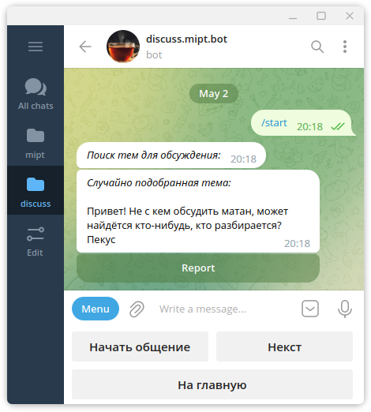

## Menu button

Here you can see all bots commands starting with '/'

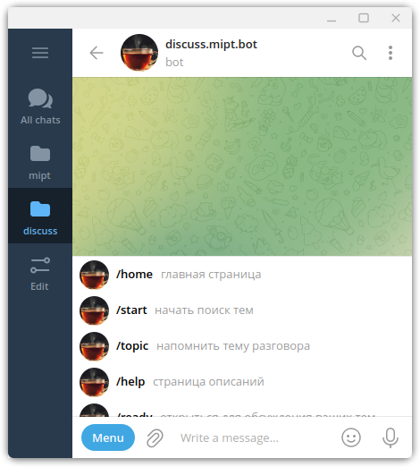

## Help page (`/help`)

Command list and some explanations

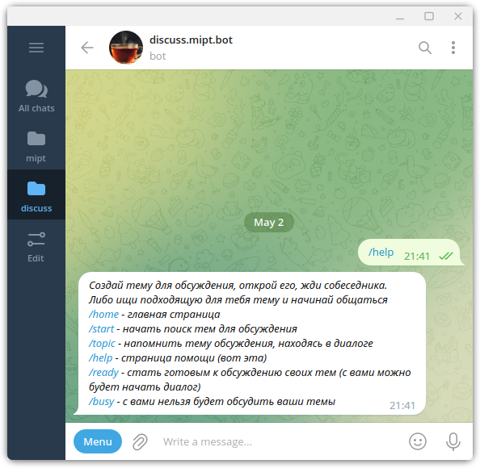

## Home page (`/home`)

This is your main page. You can start searching for topics to discuss (works as `/start` command) or manage your own.

If topic contains inappropriate content, you can report it

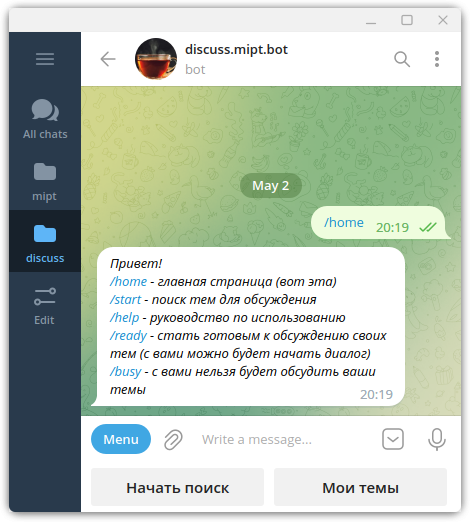

## Your topics

### Creating topic

By default you don't have any topics (of course)

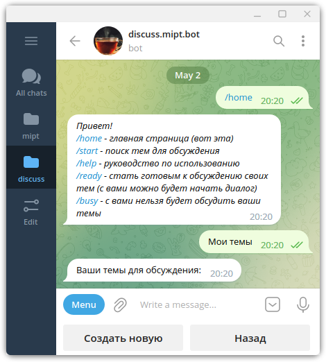

Let's create a topic with text:

<i>Hi! I'm new here. Wish everyone good evening!</i>

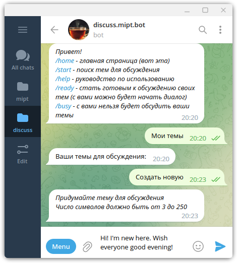
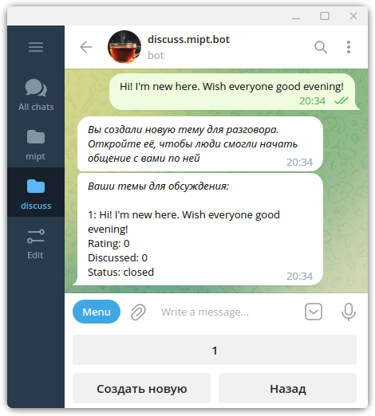

Great! We can see information about our topic:

<b>Rating</b> - difference between likes and dislikes, that is how people rated your dialog 

<b>Discussed</b> - how many times have people started to discuss this topic with you

<b>Status</b> - topic is either `opened` or `closed` for discussion. 
If it's `opened`, people will be able to find this topic in search

If we want people to discuss topic with us, we need to open it. 

After that people will be able to find this topic:

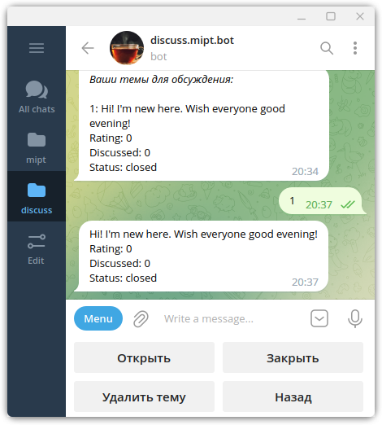
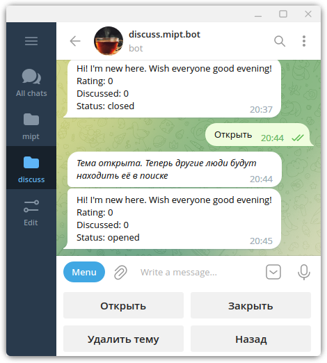

### Useful commands

`/ready` - you are ready to discuss your topics which means people can start discussion with you on opened topics

`/busy` - from now on nobody will see your topics (even opened), so only you can start discussions with others

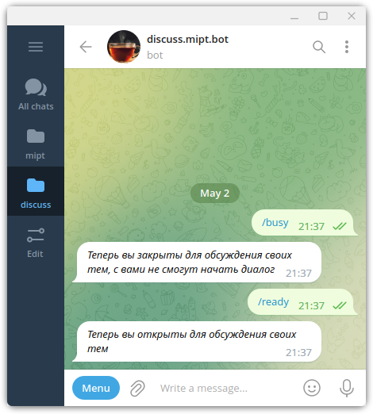

## Chatting

Let's return to searching page. We already saw one topic that person want to discuss

We are going to start communication with him

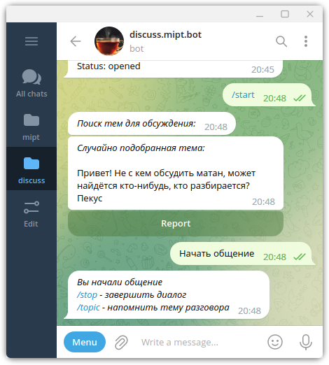

With `/topic` command we can recall the topic of the conversation.

With `/stop` the conversation will be ended. After that you can rate your talk on this topic

Other commands won't be able during this time

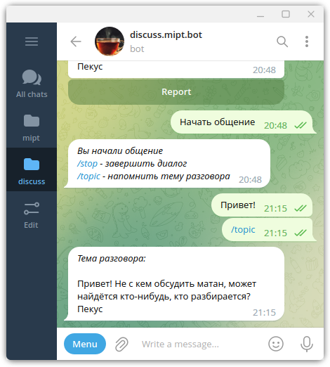
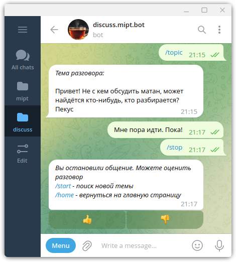
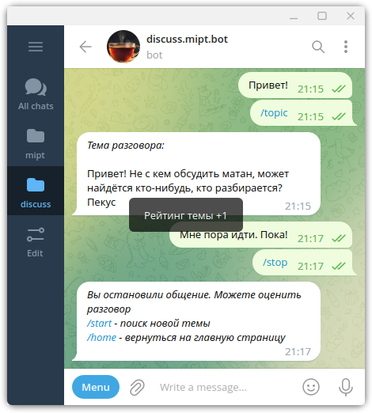
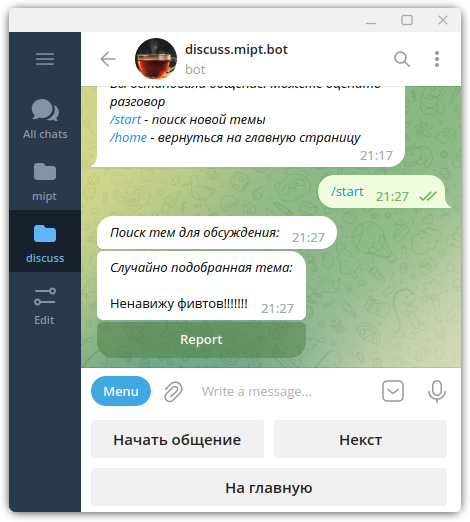
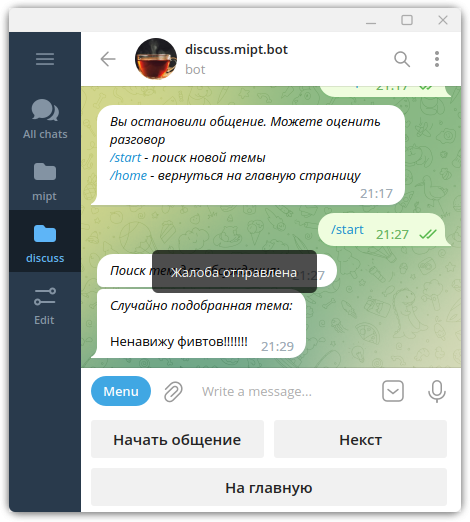
